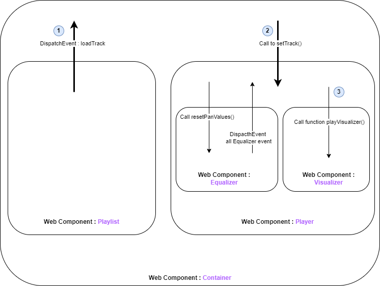

# SpotIncrease

SpotIncrease is a web application that lets users create and enjoy custom playlists with an interactive audio player. The application features a modern and intuitive user interface, complete with an equalizer for adjusting audio settings, a visualizer for a captivating audio-visual experience, and a playlist manager for organizing and selecting tracks.

## Online Website
- Here is the link for the online Spotincrease project :
  [**Spotincrease**](https://spotincrease.osc-fr1.scalingo.io/)
- Here is the link for the code : [**Github**](https://github.com/Cassandraforestier/spotincrease)

## Author
**Cassandra FORESTIER** 
#### A little bit more about me : ####
- Master 2 MIAGE - INTENSE at [**Université de Nice Côte d'Azur**](https://univ-cotedazur.fr/formation/offre-de-formation/master-methodes-informatiques-appliquees-a-la-gestion-des-entreprises)
- Find more about me on my personal website : [**Portfolio**](https://cassandraforestier.github.io/portfolio/)

## Features

- **Playlist Management:** Enjoy custom playlists with ease.
- **Interactive Audio Player:** Play, pause, and stop tracks with a sleek and responsive audio player.
- **Equalizer:** Fine-tune your audio experience with bass, mid, and treble controls.
- **Visualizer:** Immerse yourself in the music with a captivating audio visualizer.
- **Balance Control:** Adjust the balance of audio playback between left and right channels.

## Installation

1. **Clone the repository:**
   ```bash
   git clone https://github.com/your-username/SpotIncrease.git
   ```
2. **Install dependencies:**
    ```bash
    cd Spotincrease
    npm install
    ```
3. **Start the server:**
    ```bash
    npm Start
    ```
4. **Open your browser :**
    ```bash
    http://localhost:3000
    ```

## Usage
1. ***Look*** at the playlist section.
2. ***Click*** on a track to load it into the player.
3. ***Use*** the audio player controls:
- *Play*, *pause*, or *stop* the track. 
- Adjust the *equalizer* settings.
4. ***Enjoy*** the visualizer:
- Watch it come to life as you listen to your favorite music.

## Technologies Used

- **Express (Web Server Framework for Node.js)** - [Express](https://expressjs.com/) is a fast, unopinionated, minimalist web framework for Node.js. It simplifies the process of building robust and scalable web applications and APIs.
- **Web Components** - [Web Components](https://developer.mozilla.org/en-US/docs/Web/API/Web_components) Reusable and customizable UI components
- **Butterchurn** - [Butterchurn](https://butterchurnviz.com/) Audio visualizer library
- **Butterchurn Presets** - [Butterchurn Presets](https://github.com/jberg/butterchurn-presets) for the Butterchurn visualizer

## Project Structure
- `static/frontend`: Frontend assets including HTML, CSS, and JavaScript files : everything on Web components files.
- `static/musics`: Folder for storing music files.
- `static/images`: Folder for storing image assets.
- `server.js`: Express server setup and configuration.

## Screenshots



## License
This project is licensed under the ISC License.


